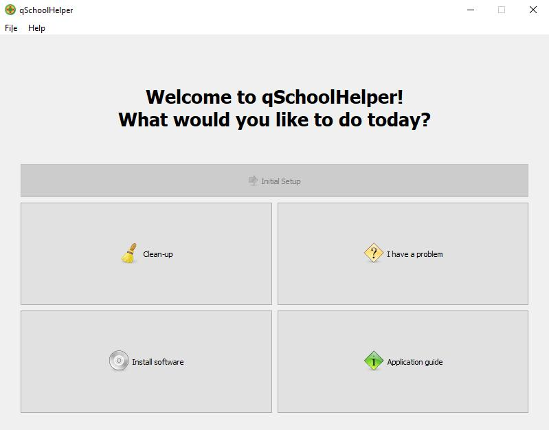
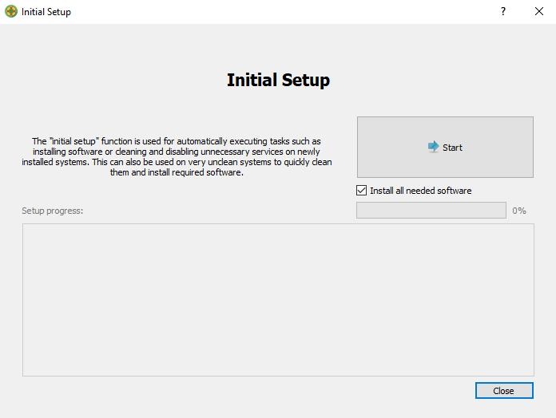
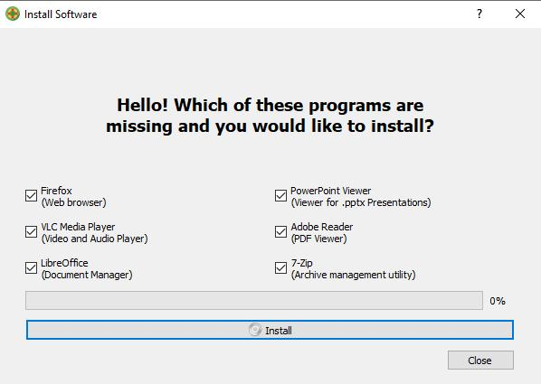
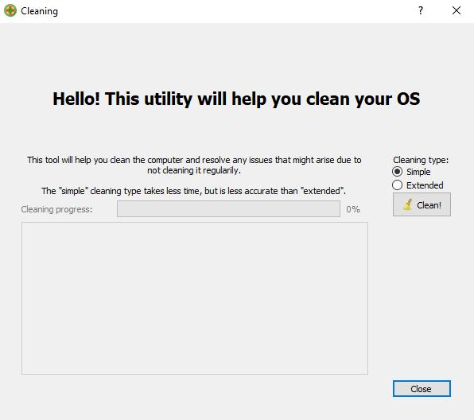
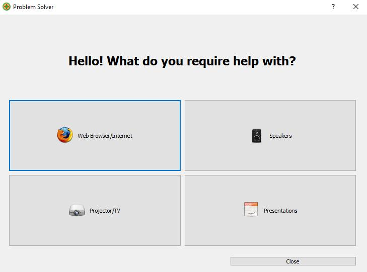
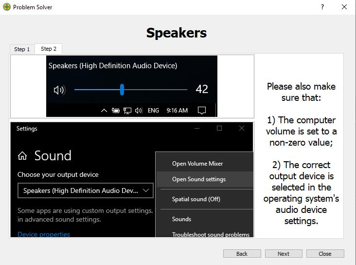

# qSchoolHelper (qSH)
[](https://www.gnu.org/licenses/gpl-3.0) [](CODE_OF_CONDUCT.md)

A Qt5 project designed to help non-tech-inclined people deal with simple problems on a Windows computer without the need to call support. 

This project has been designed and configured for use on Windows 10 computers. 

## Usage

- Grab the latest .exe from the [releases page](https://gitlab.com/Atrate/qschoolhelper/releases) or compile the app from source.
- Launch the app and follow the instructions on screen.

## Screenshots

     


### [Changelog](./CHANGELOG)

## Contributing

For guidelines on how to contribute please refer to [CONTRIBUTING.md](./CONTRIBUTING.md). Please keep in mind that all pull/merge requests should be submitted to the [GitLab repo](https://gitlab.com/Atrate/qschoolhelper), since repos on e.g. GitHub are just mirrors.

## Dependencies

- Qt 5.2 or higher
- OpenSSL (libcrypto) (included in `./lib/dll/`)
- cURL (libcurl) (included in `./lib/`)
- Visual C++ Redistributable Runtime 2015 DLLs (included in `./lib/dll/`)
- MinGW or other >= C++17 compiler

## Third-party components used

- [curl](https://github.com/curl/curl)
- [qtcurl](https://github.com/tarasvb/qtcurl)
- [BleachBit](https://www.bleachbit.org/)
- [Qt 5 Dark Fusion Palette](https://gist.github.com/QuantumCD/6245215)

## Building from source

- Install Qt 5 with a compatible >= C++ 17 compiler (tested on MinGW)
- Clone the repository
- Open the .pro file in Qt Creator and configure the project
- Compile the application
- Generate the translation files using `lrelease-pro qSchoolHelper.pro`
- Copy the translation files into `exe_dir/data/translations/`
- Use `windeployqt` to copy the required Qt libraries
- Copy all the libraries from `lib/dll` to the executable's directory
- Copy the certificate bundle into `exe_dir/data/`

## License
This project is licensed under the [GPL-3.0-or-later](https://www.gnu.org/licenses/gpl-3.0.html).

Icons adapted from:
```
https://www.iconfinder.com/icons/669949/buoy_help_life_lifebuoy_support_icon
https://www.iconfinder.com/icons/55586/clean_icon
https://www.iconfinder.com/icons/23799/firefox_icon
https://www.iconfinder.com/iconsets/UltimateGnome
``` 
